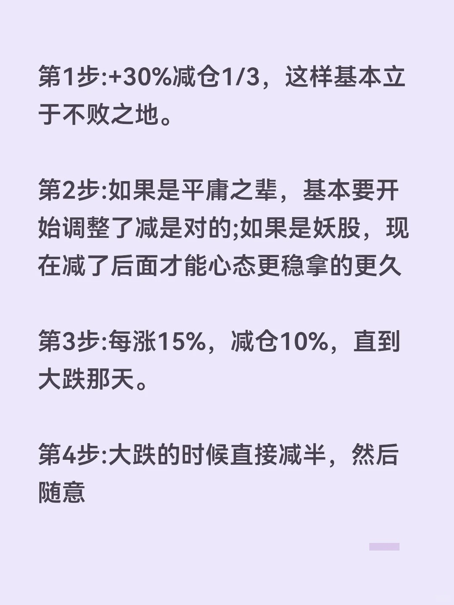

# 第十一章：风险管理基础 🛡️

> 💡 **本章导读**：风险管理是量化交易的生命线。再好的策略，如果没有完善的风险管理，也可能导致重大损失。本章将系统介绍风险管理的核心概念、仓位管理方法、止损止盈技巧以及回撤控制策略。

---

## 11.1 风险管理核心概念 📊

### 11.1.1 为什么风险管理如此重要？

**量化交易的两大支柱**：
1. **策略优势**：找到盈利机会
2. **风险管理**：保护资金安全

即使策略有正期望收益，如果风险管理不当，也可能面临：
- **爆仓风险**：单次或连续亏损导致账户归零
- **回撤过大**：资金大幅缩水，心理压力巨大
- **错失机会**：因为前期损失过大，无法把握后续盈利机会

### 11.1.2 风险的分类

| 风险类型 | 描述 | 应对措施 |
|---------|------|---------|
| **市场风险** | 市场整体波动导致的损失 | 分散投资、对冲、仓位控制 |
| **流动性风险** | 无法及时以合理价格成交 | 选择流动性好的品种、控制单笔规模 |
| **模型风险** | 策略失效、过拟合等 | 严格回测、样本外验证、定期评估 |
| **技术风险** | 系统故障、网络中断等 | 容错设计、备用系统、人工监控 |
| **操作风险** | 人为错误、参数设置失误 | 自动化、复核机制、权限管理 |
| **黑天鹅风险** | 小概率极端事件 | 预留风险准备金、极端情况应急预案 |

### 11.1.3 风险度量指标

#### 1. 波动率 (Volatility)

```python
import pandas as pd
import numpy as np

def calculate_volatility(returns, period=252):
    """
    计算波动率

    参数:
    returns: Series, 收益率序列
    period: int, 年化周期(默认252个交易日)

    返回:
    dict: 包含日波动率和年化波动率
    """
    daily_vol = returns.std()
    annual_vol = daily_vol * np.sqrt(period)

    return {
        'daily_volatility': daily_vol,
        'annual_volatility': annual_vol
    }

# 示例使用
# 假设我们有一个收益率序列
np.random.seed(42)
returns = pd.Series(np.random.randn(252) * 0.01)  # 模拟日收益率

vol = calculate_volatility(returns)
print(f"日波动率: {vol['daily_volatility']:.4f}")
print(f"年化波动率: {vol['annual_volatility']:.4f}")
```

#### 2. VaR (Value at Risk) - 风险价值

VaR表示在给定置信水平下，某一时期内可能遭受的最大损失。

```python
def calculate_var(returns, confidence_level=0.95, method='historical'):
    """
    计算VaR

    参数:
    returns: Series, 收益率序列
    confidence_level: float, 置信水平(默认95%)
    method: str, 计算方法('historical', 'parametric')

    返回:
    float: VaR值(负数表示损失)
    """
    if method == 'historical':
        # 历史模拟法
        var = np.percentile(returns, (1 - confidence_level) * 100)
    elif method == 'parametric':
        # 参数法(假设正态分布)
        mean = returns.mean()
        std = returns.std()
        z_score = np.abs(np.percentile(np.random.randn(10000), (1 - confidence_level) * 100))
        var = mean - z_score * std
    else:
        raise ValueError("method must be 'historical' or 'parametric'")

    return var

# 示例
var_95 = calculate_var(returns, confidence_level=0.95, method='historical')
var_99 = calculate_var(returns, confidence_level=0.99, method='historical')

print(f"95% VaR: {var_95:.4f} (有95%的把握,损失不会超过{abs(var_95):.2%})")
print(f"99% VaR: {var_99:.4f} (有99%的把握,损失不会超过{abs(var_99):.2%})")
```

#### 3. CVaR (Conditional VaR) - 条件风险价值

CVaR也叫期望短缺(Expected Shortfall)，表示在超过VaR的情况下，平均损失是多少。

```python
def calculate_cvar(returns, confidence_level=0.95):
    """
    计算CVaR

    参数:
    returns: Series, 收益率序列
    confidence_level: float, 置信水平

    返回:
    float: CVaR值
    """
    var = calculate_var(returns, confidence_level, method='historical')
    # CVaR是所有小于VaR的收益率的平均值
    cvar = returns[returns <= var].mean()
    return cvar

# 示例
cvar_95 = calculate_cvar(returns, 0.95)
print(f"95% CVaR: {cvar_95:.4f} (超过VaR时,平均损失为{abs(cvar_95):.2%})")
```

### 11.1.4 风险管理的黄金法则

1. **永远不要孤注一掷**：单个交易不应承担过大风险
2. **控制总体风险敞口**：所有头寸的总风险要在可承受范围内
3. **分散投资**：不要把所有鸡蛋放在一个篮子里
4. **严格止损**：设定并执行止损规则
5. **保持流动性**：预留足够的现金或流动资产
6. **持续监控**：实时跟踪风险指标
7. **压力测试**：定期进行极端情况模拟

---

## 11.2 仓位管理方法 💰

仓位管理决定了每次交易投入多少资金，是风险管理的核心环节。

### 11.2.1 固定金额法

**原理**：每次交易投入固定金额，无论账户总资金多少。

```python
class FixedAmountPositionSizing:
    """固定金额仓位管理"""

    def __init__(self, fixed_amount):
        """
        参数:
        fixed_amount: float, 每次交易的固定金额
        """
        self.fixed_amount = fixed_amount

    def calculate_position(self, account_value, price):
        """
        计算仓位

        参数:
        account_value: float, 账户总资产
        price: float, 当前价格

        返回:
        int: 可买入的股数
        """
        shares = int(self.fixed_amount / price)
        return shares

# 示例
position_sizer = FixedAmountPositionSizing(fixed_amount=10000)
account_value = 100000
price = 50

shares = position_sizer.calculate_position(account_value, price)
print(f"固定金额法: 以{price}元价格买入{shares}股")
print(f"实际投入: {shares * price}元")
```

**优点**：
- 简单易懂
- 风险固定

**缺点**：
- 不随账户规模调整
- 账户增长时，相对风险变小；账户缩水时，相对风险变大

### 11.2.2 固定比例法

**原理**：每次交易投入账户总资金的固定比例。

```python
class FixedPercentagePositionSizing:
    """固定比例仓位管理"""

    def __init__(self, percentage):
        """
        参数:
        percentage: float, 投入比例(0-1之间)
        """
        self.percentage = percentage

    def calculate_position(self, account_value, price):
        """
        计算仓位

        参数:
        account_value: float, 账户总资产
        price: float, 当前价格

        返回:
        int: 可买入的股数
        """
        amount = account_value * self.percentage
        shares = int(amount / price)
        return shares

# 示例
position_sizer = FixedPercentagePositionSizing(percentage=0.2)  # 每次投入20%

shares = position_sizer.calculate_position(account_value, price)
print(f"固定比例法(20%): 以{price}元价格买入{shares}股")
print(f"实际投入: {shares * price}元, 占比: {shares * price / account_value:.2%}")
```

**优点**：
- 自动随账户规模调整
- 风险相对稳定

**缺点**：
- 不考虑不同品种的波动性差异
- 不考虑策略的胜率和盈亏比

### 11.2.3 波动率调整法

**原理**：根据标的波动率调整仓位，波动率越高，仓位越小。

```python
class VolatilityAdjustedPositionSizing:
    """波动率调整仓位管理"""

    def __init__(self, target_volatility, max_percentage=0.3):
        """
        参数:
        target_volatility: float, 目标波动率(年化)
        max_percentage: float, 最大仓位比例
        """
        self.target_volatility = target_volatility
        self.max_percentage = max_percentage

    def calculate_position(self, account_value, price, asset_volatility):
        """
        计算仓位

        参数:
        account_value: float, 账户总资产
        price: float, 当前价格
        asset_volatility: float, 标的年化波动率

        返回:
        int: 可买入的股数
        """
        # 仓位比例 = 目标波动率 / 标的波动率
        percentage = min(self.target_volatility / asset_volatility, self.max_percentage)
        amount = account_value * percentage
        shares = int(amount / price)
        return shares, percentage

# 示例
position_sizer = VolatilityAdjustedPositionSizing(target_volatility=0.15)

# 低波动标的
low_vol_shares, low_vol_pct = position_sizer.calculate_position(
    account_value, price, asset_volatility=0.2
)
print(f"低波动标的(年化波动率20%): 买入{low_vol_shares}股, 仓位{low_vol_pct:.2%}")

# 高波动标的
high_vol_shares, high_vol_pct = position_sizer.calculate_position(
    account_value, price, asset_volatility=0.5
)
print(f"高波动标的(年化波动率50%): 买入{high_vol_shares}股, 仓位{high_vol_pct:.2%}")
```

**优点**：
- 考虑了风险特征
- 自动调整，风险一致

**缺点**：
- 需要准确估计波动率
- 历史波动率可能不代表未来

### 11.2.4 凯利公式 (Kelly Criterion)

**原理**：根据策略的胜率和盈亏比，计算最优仓位比例，使长期资金增长最大化。

**公式**：
```
f* = (p * (b + 1) - 1) / b
```
其中：
- f*: 最优仓位比例
- p: 胜率
- b: 盈亏比 (平均盈利/平均亏损)

```python
class KellyPositionSizing:
    """凯利公式仓位管理"""

    def __init__(self, win_rate, profit_loss_ratio, kelly_fraction=0.5):
        """
        参数:
        win_rate: float, 胜率(0-1)
        profit_loss_ratio: float, 盈亏比(平均盈利/平均亏损)
        kelly_fraction: float, 凯利分数(通常使用0.25-0.5,降低风险)
        """
        self.win_rate = win_rate
        self.profit_loss_ratio = profit_loss_ratio
        self.kelly_fraction = kelly_fraction

    def calculate_kelly_percentage(self):
        """
        计算凯利仓位比例

        返回:
        float: 最优仓位比例
        """
        p = self.win_rate
        b = self.profit_loss_ratio

        # 完整凯利公式
        kelly = (p * (b + 1) - 1) / b

        # 应用凯利分数
        adjusted_kelly = kelly * self.kelly_fraction

        # 确保不为负
        adjusted_kelly = max(0, adjusted_kelly)

        return adjusted_kelly

    def calculate_position(self, account_value, price):
        """
        计算仓位

        参数:
        account_value: float, 账户总资产
        price: float, 当前价格

        返回:
        int: 可买入的股数
        """
        percentage = self.calculate_kelly_percentage()
        amount = account_value * percentage
        shares = int(amount / price)
        return shares, percentage

# 示例
# 假设策略胜率60%,平均盈利是平均亏损的1.5倍
position_sizer = KellyPositionSizing(
    win_rate=0.6,
    profit_loss_ratio=1.5,
    kelly_fraction=0.5  # 使用半凯利
)

kelly_pct = position_sizer.calculate_kelly_percentage()
print(f"凯利公式建议仓位: {kelly_pct:.2%}")

shares, pct = position_sizer.calculate_position(account_value, price)
print(f"应买入{shares}股, 实际仓位{pct:.2%}")

# 不同胜率和盈亏比的对比
scenarios = [
    (0.55, 1.2, "保守策略"),
    (0.60, 1.5, "均衡策略"),
    (0.65, 2.0, "激进策略"),
]

print("\n不同策略的凯利仓位对比:")
for win_rate, pl_ratio, name in scenarios:
    ps = KellyPositionSizing(win_rate, pl_ratio, kelly_fraction=0.5)
    kelly = ps.calculate_kelly_percentage()
    print(f"{name} (胜率{win_rate:.0%}, 盈亏比{pl_ratio}): 建议仓位{kelly:.2%}")
```

**重要提示**：
- 完整凯利公式过于激进，实践中常用半凯利(kelly_fraction=0.5)或四分之一凯利
- 需要准确估计胜率和盈亏比
- 适用于可重复多次的交易

### 11.2.5 风险平价法 (Risk Parity)

**原理**：使每个资产对投资组合的风险贡献相等。

```python
class RiskParityPositionSizing:
    """风险平价仓位管理"""

    def __init__(self):
        pass

    def calculate_positions(self, account_value, prices, volatilities):
        """
        计算各资产的仓位

        参数:
        account_value: float, 账户总资产
        prices: dict, 各资产价格 {asset_name: price}
        volatilities: dict, 各资产年化波动率 {asset_name: volatility}

        返回:
        dict: 各资产的股数和金额
        """
        # 计算各资产的风险权重(波动率的倒数)
        inv_vol = {asset: 1.0 / vol for asset, vol in volatilities.items()}
        total_inv_vol = sum(inv_vol.values())

        # 归一化得到权重
        weights = {asset: iv / total_inv_vol for asset, iv in inv_vol.items()}

        # 计算各资产的金额和股数
        positions = {}
        for asset, weight in weights.items():
            amount = account_value * weight
            price = prices[asset]
            shares = int(amount / price)
            positions[asset] = {
                'shares': shares,
                'amount': shares * price,
                'weight': weight
            }

        return positions

# 示例
position_sizer = RiskParityPositionSizing()

prices = {
    '股票A': 100,
    '股票B': 50,
    '股票C': 200
}

volatilities = {
    '股票A': 0.3,  # 高波动
    '股票B': 0.15, # 低波动
    '股票C': 0.4   # 很高波动
}

positions = position_sizer.calculate_positions(account_value, prices, volatilities)

print("风险平价配置结果:")
for asset, pos in positions.items():
    print(f"{asset}: {pos['shares']}股, {pos['amount']:.0f}元, 权重{pos['weight']:.2%}, 波动率{volatilities[asset]:.1%}")
```

**优点**：
- 多资产组合风险更均衡
- 避免高波动资产主导风险

**缺点**：
- 不考虑收益预期
- 低波动资产可能获得过高权重

---

## 11.3 止损止盈技巧 ⚡

### 11.3.1 止损的重要性

**止损是保命的红线！**

不止损的后果：
- 小亏变大亏
- 回本越来越难（亏50%需要涨100%才能回本）
- 心理负担越来越重
- 错失其他机会

### 11.3.2 止损方法

#### 1. 固定百分比止损

```python
class FixedPercentageStopLoss:
    """固定百分比止损"""

    def __init__(self, stop_loss_pct):
        """
        参数:
        stop_loss_pct: float, 止损百分比(如0.05表示5%)
        """
        self.stop_loss_pct = stop_loss_pct

    def calculate_stop_price(self, entry_price):
        """
        计算止损价格

        参数:
        entry_price: float, 入场价格

        返回:
        float: 止损价格
        """
        stop_price = entry_price * (1 - self.stop_loss_pct)
        return stop_price

    def should_stop(self, entry_price, current_price):
        """
        判断是否应该止损

        参数:
        entry_price: float, 入场价格
        current_price: float, 当前价格

        返回:
        bool: 是否止损
        """
        stop_price = self.calculate_stop_price(entry_price)
        return current_price <= stop_price

# 示例
stop_loss = FixedPercentageStopLoss(stop_loss_pct=0.05)  # 5%止损

entry_price = 100
stop_price = stop_loss.calculate_stop_price(entry_price)
print(f"入场价格: {entry_price}元, 止损价格: {stop_price}元")

# 模拟价格变化
prices = [100, 98, 96, 94, 92]
for price in prices:
    should_stop = stop_loss.should_stop(entry_price, price)
    loss_pct = (price - entry_price) / entry_price
    print(f"当前价格: {price}元, 亏损: {loss_pct:.2%}, 是否止损: {should_stop}")
```

#### 2. ATR止损 (Average True Range)

```python
import pandas as pd

class ATRStopLoss:
    """ATR止损"""

    def __init__(self, atr_multiplier=2, atr_period=14):
        """
        参数:
        atr_multiplier: float, ATR倍数
        atr_period: int, ATR计算周期
        """
        self.atr_multiplier = atr_multiplier
        self.atr_period = atr_period

    def calculate_atr(self, high, low, close):
        """
        计算ATR

        参数:
        high: Series, 最高价
        low: Series, 最低价
        close: Series, 收盘价

        返回:
        Series: ATR值
        """
        # True Range
        tr1 = high - low
        tr2 = abs(high - close.shift(1))
        tr3 = abs(low - close.shift(1))
        tr = pd.concat([tr1, tr2, tr3], axis=1).max(axis=1)

        # ATR
        atr = tr.rolling(window=self.atr_period).mean()
        return atr

    def calculate_stop_price(self, entry_price, atr_value, position='long'):
        """
        计算止损价格

        参数:
        entry_price: float, 入场价格
        atr_value: float, 当前ATR值
        position: str, 持仓方向('long'或'short')

        返回:
        float: 止损价格
        """
        if position == 'long':
            stop_price = entry_price - self.atr_multiplier * atr_value
        else:  # short
            stop_price = entry_price + self.atr_multiplier * atr_value

        return stop_price

# 示例
np.random.seed(42)
# 模拟价格数据
dates = pd.date_range('2024-01-01', periods=30)
close = pd.Series(100 + np.cumsum(np.random.randn(30) * 2), index=dates)
high = close + abs(np.random.randn(30) * 1)
low = close - abs(np.random.randn(30) * 1)

stop_loss = ATRStopLoss(atr_multiplier=2, atr_period=14)
atr = stop_loss.calculate_atr(high, low, close)

entry_price = close.iloc[-1]
atr_value = atr.iloc[-1]
stop_price = stop_loss.calculate_stop_price(entry_price, atr_value, position='long')

print(f"入场价格: {entry_price:.2f}元")
print(f"当前ATR: {atr_value:.2f}")
print(f"止损价格: {stop_price:.2f}元")
print(f"止损空间: {((stop_price - entry_price) / entry_price):.2%}")
```

#### 3. 移动止损 (Trailing Stop)

```python
class TrailingStopLoss:
    """移动止损"""

    def __init__(self, trailing_pct):
        """
        参数:
        trailing_pct: float, 移动止损百分比
        """
        self.trailing_pct = trailing_pct
        self.highest_price = None
        self.stop_price = None

    def update(self, current_price, is_first=False):
        """
        更新止损价格

        参数:
        current_price: float, 当前价格
        is_first: bool, 是否首次(入场时)

        返回:
        dict: 包含最高价和止损价
        """
        if is_first or self.highest_price is None:
            # 首次入场
            self.highest_price = current_price
            self.stop_price = current_price * (1 - self.trailing_pct)
        else:
            # 更新最高价
            if current_price > self.highest_price:
                self.highest_price = current_price
                # 止损价上移
                new_stop = self.highest_price * (1 - self.trailing_pct)
                self.stop_price = max(self.stop_price, new_stop)

        return {
            'highest_price': self.highest_price,
            'stop_price': self.stop_price,
            'should_stop': current_price <= self.stop_price
        }

# 示例
trailing_stop = TrailingStopLoss(trailing_pct=0.1)  # 10%移动止损

# 模拟价格走势
price_series = [100, 105, 110, 108, 112, 115, 110, 105, 100]

print("移动止损示例:")
for i, price in enumerate(price_series):
    result = trailing_stop.update(price, is_first=(i == 0))
    print(f"价格: {price:.0f}, 最高价: {result['highest_price']:.0f}, "
          f"止损价: {result['stop_price']:.2f}, 是否止损: {result['should_stop']}")

    if result['should_stop']:
        print("触发止损,退出!")
        break
```

### 11.3.3 止盈方法

#### 1. 固定目标止盈

```python
class FixedTargetTakeProfit:
    """固定目标止盈"""

    def __init__(self, target_pct):
        """
        参数:
        target_pct: float, 目标收益率
        """
        self.target_pct = target_pct

    def calculate_target_price(self, entry_price):
        """
        计算目标价格

        参数:
        entry_price: float, 入场价格

        返回:
        float: 目标价格
        """
        target_price = entry_price * (1 + self.target_pct)
        return target_price

    def should_take_profit(self, entry_price, current_price):
        """
        判断是否应该止盈

        参数:
        entry_price: float, 入场价格
        current_price: float, 当前价格

        返回:
        bool: 是否止盈
        """
        target_price = self.calculate_target_price(entry_price)
        return current_price >= target_price

# 示例
take_profit = FixedTargetTakeProfit(target_pct=0.15)  # 15%止盈

entry_price = 100
target_price = take_profit.calculate_target_price(entry_price)
print(f"入场价格: {entry_price}元, 目标价格: {target_price}元")
```

#### 2. 分批止盈

```python
class PartialTakeProfit:
    """分批止盈"""

    def __init__(self, targets):
        """
        参数:
        targets: list of tuples, [(价格百分比, 平仓比例), ...]
        """
        self.targets = sorted(targets, key=lambda x: x[0])
        self.executed_targets = set()

    def check_targets(self, entry_price, current_price, current_position):
        """
        检查是否触达止盈目标

        参数:
        entry_price: float, 入场价格
        current_price: float, 当前价格
        current_position: int, 当前持仓

        返回:
        dict: 止盈建议
        """
        suggestions = []

        for i, (pct, close_ratio) in enumerate(self.targets):
            if i in self.executed_targets:
                continue

            target_price = entry_price * (1 + pct)

            if current_price >= target_price:
                close_amount = int(current_position * close_ratio)
                suggestions.append({
                    'target_index': i,
                    'target_pct': pct,
                    'target_price': target_price,
                    'close_ratio': close_ratio,
                    'close_amount': close_amount
                })
                self.executed_targets.add(i)

        return suggestions

# 示例
# 定义分批止盈目标: 涨10%平1/3, 涨20%平1/2, 涨30%全平
take_profit = PartialTakeProfit(targets=[
    (0.10, 1/3),  # 涨10%,平仓1/3
    (0.20, 1/2),  # 涨20%,平仓1/2
    (0.30, 1.0),  # 涨30%,全部平仓
])

entry_price = 100
position = 1000  # 持仓1000股

# 模拟价格上涨
prices = [100, 105, 110, 115, 120, 125, 130, 135]

print("分批止盈示例:")
current_position = position
for price in prices:
    profit_pct = (price - entry_price) / entry_price
    print(f"\n当前价格: {price}元, 收益率: {profit_pct:.2%}, 持仓: {current_position}股")

    suggestions = take_profit.check_targets(entry_price, price, current_position)

    for sug in suggestions:
        print(f"  触发止盈目标: 涨幅{sug['target_pct']:.0%}, "
              f"建议平仓{sug['close_amount']}股({sug['close_ratio']:.1%})")
        current_position -= sug['close_amount']
```

#### 3. 动态止盈 (基于技术指标)

```python
class DynamicTakeProfit:
    """动态止盈(基于布林带)"""

    def __init__(self, period=20, std_multiplier=2):
        """
        参数:
        period: int, 移动平均周期
        std_multiplier: float, 标准差倍数
        """
        self.period = period
        self.std_multiplier = std_multiplier

    def calculate_bollinger_bands(self, prices):
        """
        计算布林带

        参数:
        prices: Series, 价格序列

        返回:
        dict: 上轨、中轨、下轨
        """
        ma = prices.rolling(window=self.period).mean()
        std = prices.rolling(window=self.period).std()

        upper_band = ma + self.std_multiplier * std
        lower_band = ma - self.std_multiplier * std

        return {
            'upper': upper_band,
            'middle': ma,
            'lower': lower_band
        }

    def should_take_profit(self, prices, current_price, position='long'):
        """
        判断是否止盈

        参数:
        prices: Series, 历史价格
        current_price: float, 当前价格
        position: str, 持仓方向

        返回:
        bool: 是否止盈
        """
        bands = self.calculate_bollinger_bands(prices)
        current_upper = bands['upper'].iloc[-1]

        if position == 'long':
            # 多头: 价格触及或超过上轨时止盈
            return current_price >= current_upper
        else:
            # 空头: 价格触及或低于下轨时止盈
            current_lower = bands['lower'].iloc[-1]
            return current_price <= current_lower

# 示例
take_profit = DynamicTakeProfit(period=20, std_multiplier=2)

# 模拟价格数据
np.random.seed(42)
prices = pd.Series(100 + np.cumsum(np.random.randn(30) * 2))

bands = take_profit.calculate_bollinger_bands(prices)
current_price = 110

should_tp = take_profit.should_take_profit(prices, current_price, position='long')

print(f"当前价格: {current_price:.2f}")
print(f"布林带上轨: {bands['upper'].iloc[-1]:.2f}")
print(f"布林带中轨: {bands['middle'].iloc[-1]:.2f}")
print(f"布林带下轨: {bands['lower'].iloc[-1]:.2f}")
print(f"是否止盈: {should_tp}")
```

#### 4. 妖股"滚雪球"止盈策略 🐉

**适用场景**：高波动个股、妖股、主升浪

这是一套专门为"高波动妖股"量身定制的完整止盈体系。其核心不在于追求数学上的利益最大化，而在于**对人性的极致拿捏**——通过仓位管理，强制让心态始终处于"舒适区"。

##### 策略四步法

```
第1步：立于不败（安全垫）
收益+30% → 坚决减仓1/3
回收本金压力，建立心理防线

第2步：心态建设（无悔博弈）
无论平庸或成妖，减仓都是对的
不被市场情绪左右，心态无悔

第3步：金字塔离场（不猜顶）
每再涨+15% → 减仓10%
边涨边卖，让利润奔跑，风险递减

第4步：趋势熔断（终局纪律）
确认大跌 → 直接减半！（剩余随缘）
严格执行纪律，避免灾难性回撤
```

**策略可视化图**：



*图：妖股"滚雪球"止盈策略四步法 - 反脆弱资金管理体系*

---

##### 核心逻辑详解

**第1步：安全垫法则（+30%减仓1/3）**

```
战术意图：回收本金，建立心理防线
效果：只要这一步做到了，后续无论股价怎么跌，你都不会亏损本金（或者亏损极小）
      这时候你用的已经是市场的钱(House Money)在博弈，心态会发生质的飞跃
```

**第2步：无悔博弈（心态建设）**

```
战术意图：解决"卖飞"和"坐过山车"的矛盾

逻辑闭环：
- 若变盘向下：幸好我减了，保住了果实
- 若继续成妖：幸好我没清仓，还能享受主升浪

本质：无论市场怎么走，你都给了自己一个"我是对的"的心理暗示
      这在交易中是维持理智的关键
```

**第3步：金字塔式离场（每涨15%减10%）**

```
战术意图：既然是妖股，就不猜顶，边涨边卖
效果：随着股价升高，风险也在累积
      通过逐步降低仓位，你的风险敞口在不断缩小，但你的利润总额在不断增加
      这叫"吃鱼身，吐鱼刺"
```

**第4步：趋势熔断（大跌减半+随缘）**

```
战术意图：确认趋势反转，锁定胜局
效果："大跌"通常是妖股见顶的信号（断头铡刀）
      这时候减半是最后的纪律
      剩下的"随意"，是因为剩下的全是纯利润（零成本筹码）
      你可以陪庄家玩到退市，也可以博一个"双顶"反抽，完全没有心理负担
```

##### 模拟推演：如果遇到一只翻倍妖股

假设您买入**10,000元**某妖股，成本**10元/股**（1000股）

| 阶段 | 股价表现 | 操作动作 | 剩余持仓 | 账户状态 | 心理状态 |
|-----|---------|---------|---------|---------|---------|
| **启动** | 涨到13元<br/>(+30%) | 卖出333股<br/>（收回约4330元） | 667股 | 已落袋4330元 | **立于不败**<br/>本金风险仅剩50% |
| **中继** | 只有普通涨幅<br/>此时心态：它是平庸之辈 | 持有/卖出 | - | 小赚离场 | 不纠结，寻找下一个 |
| **成妖** | 涨到15元<br/>(+15%) | 卖出100股<br/>（收回1500元） | 567股 | 累计落袋<br/>5830元 | 越涨越开心<br/>越卖越轻松 |
| **加速** | 涨到17.25元<br/>(+15%) | 卖出100股<br/>（收回1725元） | 467股 | 累计落袋<br/>7555元 | 已经收回75%本金 |
| **见顶** | 涨到20元 | 未触及大跌，持有 | 467股 | 市值飙升 | 享受泡沫 |
| **崩盘** | 大跌至18元 | 卖出233股<br/>（收回4194元） | 234股 | **本金全回**<br/>且大赚 | 剩下的全是利润送的 |

**总结收益**：
```
初始投资：10,000元
累计卖出：4330 + 1500 + 1725 + 4194 = 11,749元
剩余持仓：234股 × 18元 = 4,212元
总资产：11,749 + 4,212 = 15,961元
总收益：+59.61%

关键：即使后续股价腰斩，你依然盈利！
```

##### Python代码实现

```python
class MonsterStockTakeProfitStrategy:
    """妖股"滚雪球"止盈策略"""

    def __init__(self, initial_capital, entry_price, initial_shares):
        """
        参数:
        initial_capital: float, 初始投资金额
        entry_price: float, 入场价格
        initial_shares: int, 初始股数
        """
        self.initial_capital = initial_capital
        self.entry_price = entry_price
        self.initial_shares = initial_shares
        self.current_shares = initial_shares

        # 止盈阶段跟踪
        self.stage = 'holding'  # holding, stage1, stage2, stage3, final
        self.total_sold_amount = 0  # 累计卖出金额
        self.trades = []  # 交易记录

        # 阶段3的触发记录
        self.stage3_last_trigger_price = 0

    def check_and_execute(self, current_price):
        """
        检查并执行止盈策略

        参数:
        current_price: float, 当前价格

        返回:
        dict: 操作建议
        """
        gain_pct = (current_price - self.entry_price) / self.entry_price

        result = {
            'current_price': current_price,
            'gain_pct': gain_pct,
            'stage': self.stage,
            'action': 'hold',
            'sell_shares': 0,
            'sell_amount': 0,
            'remaining_shares': self.current_shares,
            'message': ''
        }

        # 阶段1：+30%，减仓1/3
        if self.stage == 'holding' and gain_pct >= 0.30:
            sell_shares = int(self.initial_shares * 0.333)
            sell_amount = sell_shares * current_price

            self.current_shares -= sell_shares
            self.total_sold_amount += sell_amount
            self.stage = 'stage1'

            self.trades.append({
                'price': current_price,
                'action': 'sell',
                'shares': sell_shares,
                'amount': sell_amount,
                'stage': '阶段1：安全垫'
            })

            result.update({
                'action': 'sell',
                'sell_shares': sell_shares,
                'sell_amount': sell_amount,
                'remaining_shares': self.current_shares,
                'message': f'🛡️ 阶段1触发：涨幅{gain_pct:.1%}，卖出{sell_shares}股（1/3仓位），回收{sell_amount:.0f}元。立于不败！'
            })

        # 阶段3：每涨15%，减仓10%（需要先过了阶段1）
        elif self.stage in ['stage1', 'stage2', 'stage3']:
            # 计算从最后一次阶段3触发以来的涨幅
            if self.stage3_last_trigger_price == 0:
                # 第一次进入阶段3，从入场价+30%开始计算
                base_price = self.entry_price * 1.30
            else:
                base_price = self.stage3_last_trigger_price

            gain_from_last = (current_price - base_price) / base_price

            if gain_from_last >= 0.15:
                # 减仓10%（基于初始仓位）
                sell_shares = int(self.initial_shares * 0.10)
                if sell_shares > self.current_shares:
                    sell_shares = self.current_shares

                if sell_shares > 0:
                    sell_amount = sell_shares * current_price

                    self.current_shares -= sell_shares
                    self.total_sold_amount += sell_amount
                    self.stage = 'stage3'
                    self.stage3_last_trigger_price = current_price

                    self.trades.append({
                        'price': current_price,
                        'action': 'sell',
                        'shares': sell_shares,
                        'amount': sell_amount,
                        'stage': '阶段3：金字塔离场'
                    })

                    result.update({
                        'action': 'sell',
                        'sell_shares': sell_shares,
                        'sell_amount': sell_amount,
                        'remaining_shares': self.current_shares,
                        'message': f'📈 阶段3触发：再涨{gain_from_last:.1%}，卖出{sell_shares}股（10%仓位），回收{sell_amount:.0f}元。边涨边卖！'
                    })

        return result

    def check_big_drop(self, current_price, previous_close, drop_threshold=-0.07):
        """
        检查大跌并执行阶段4

        参数:
        current_price: float, 当前价格
        previous_close: float, 前一日收盘价
        drop_threshold: float, 大跌阈值（默认-7%）

        返回:
        dict: 操作建议
        """
        drop_pct = (current_price - previous_close) / previous_close

        result = {
            'current_price': current_price,
            'drop_pct': drop_pct,
            'action': 'hold',
            'sell_shares': 0,
            'remaining_shares': self.current_shares,
            'message': ''
        }

        if drop_pct <= drop_threshold and self.current_shares > 0:
            # 大跌，减半
            sell_shares = int(self.current_shares * 0.5)
            sell_amount = sell_shares * current_price

            self.current_shares -= sell_shares
            self.total_sold_amount += sell_amount
            self.stage = 'final'

            self.trades.append({
                'price': current_price,
                'action': 'sell',
                'shares': sell_shares,
                'amount': sell_amount,
                'stage': '阶段4：趋势熔断'
            })

            result.update({
                'action': 'sell',
                'sell_shares': sell_shares,
                'sell_amount': sell_amount,
                'remaining_shares': self.current_shares,
                'message': f'⚠️ 阶段4触发：大跌{drop_pct:.1%}，直接减半！卖出{sell_shares}股，剩余{self.current_shares}股随缘。'
            })

        return result

    def get_summary(self, current_price):
        """
        获取策略执行摘要

        参数:
        current_price: float, 当前价格

        返回:
        dict: 摘要信息
        """
        remaining_value = self.current_shares * current_price
        total_value = self.total_sold_amount + remaining_value
        total_profit = total_value - self.initial_capital
        profit_pct = total_profit / self.initial_capital

        return {
            'initial_capital': self.initial_capital,
            'entry_price': self.entry_price,
            'current_price': current_price,
            'total_sold_amount': self.total_sold_amount,
            'remaining_shares': self.current_shares,
            'remaining_value': remaining_value,
            'total_value': total_value,
            'total_profit': total_profit,
            'profit_pct': profit_pct,
            'trades': self.trades
        }

# 使用示例
"""
# 初始化策略
strategy = MonsterStockTakeProfitStrategy(
    initial_capital=10000,
    entry_price=10.0,
    initial_shares=1000
)

# 模拟价格变化
prices = [10.0, 11.0, 12.0, 13.0, 14.0, 15.0, 16.0, 17.25, 18.5, 20.0, 18.0]
previous_price = 20.0

print("妖股滚雪球止盈策略模拟\n" + "="*50)

for price in prices:
    # 检查常规止盈
    result = strategy.check_and_execute(price)

    if result['action'] == 'sell':
        print(result['message'])

    # 检查大跌（最后一个价格）
    if price == 18.0:
        drop_result = strategy.check_big_drop(price, previous_price)
        if drop_result['action'] == 'sell':
            print(drop_result['message'])

    previous_price = price

# 打印摘要
print("\n" + "="*50)
print("策略执行摘要：")
summary = strategy.get_summary(18.0)
print(f"初始投资：{summary['initial_capital']:.0f}元")
print(f"累计卖出：{summary['total_sold_amount']:.0f}元")
print(f"剩余持仓：{summary['remaining_shares']}股 × {summary['current_price']:.2f}元 = {summary['remaining_value']:.0f}元")
print(f"总资产：{summary['total_value']:.0f}元")
print(f"总收益：{summary['profit_pct']:.2%}（+{summary['total_profit']:.0f}元）")

print(f"\n交易记录：")
for i, trade in enumerate(summary['trades'], 1):
    print(f"{i}. {trade['stage']} - 价格{trade['price']:.2f}元，卖出{trade['shares']}股，回收{trade['amount']:.0f}元")
"""
```

##### 策略精髓总结

这套策略的核心在于：

```
✓ 承认自己无法预测最高点，所以选择分批兑现
✓ 承认自己也是凡人，所以通过规则克服贪婪与恐惧
✓ 不追求数学最优，而追求心理舒适
✓ 让规则代替人性，用纪律战胜贪婪
```

这不仅仅是交易策略，更是一种**"反脆弱"的资金管理哲学**。

**适用人群**：
- ✓ 经常遇到大涨后回吐利润的投资者
- ✓ 持有妖股时心态失衡的投资者
- ✓ 不知道何时止盈的投资者
- ✓ 想要系统化管理高波动个股的投资者

**不适用场景**：
- ✗ 稳健蓝筹股（波动小，不适合分批止盈）
- ✗ 长期价值投资（这是短中期交易策略）
- ✗ 震荡市（需要明确趋势）

⚠️ **风险提示**：
- 妖股风险极大，可能突然崩盘
- 此策略只能降低风险，不能消除风险
- 建议妖股仓位不超过总资产的10-20%
- 严格执行纪律，不要因为贪婪修改规则

---

## 11.4 回撤控制策略 📉

### 11.4.1 什么是回撤？

**回撤(Drawdown)**：从资金曲线的峰值到后续谷值的下跌幅度。

```python
def calculate_drawdown_series(equity_curve):
    """
    计算回撤序列

    参数:
    equity_curve: Series, 资金曲线

    返回:
    DataFrame: 包含累计最高值、回撤金额、回撤比例
    """
    df = pd.DataFrame()
    df['equity'] = equity_curve

    # 累计最高值
    df['cumulative_max'] = df['equity'].cummax()

    # 回撤金额
    df['drawdown_amount'] = df['equity'] - df['cumulative_max']

    # 回撤比例
    df['drawdown_pct'] = df['drawdown_amount'] / df['cumulative_max']

    return df

# 示例
np.random.seed(42)
# 模拟资金曲线
returns = pd.Series(np.random.randn(100) * 0.02)
equity_curve = (1 + returns).cumprod() * 100000

dd_df = calculate_drawdown_series(equity_curve)

print("回撤分析:")
print(f"最大回撤: {dd_df['drawdown_pct'].min():.2%}")
print(f"当前回撤: {dd_df['drawdown_pct'].iloc[-1]:.2%}")

# 可视化
import matplotlib.pyplot as plt

fig, axes = plt.subplots(2, 1, figsize=(12, 8))

# 资金曲线
axes[0].plot(dd_df.index, dd_df['equity'], label='资金曲线')
axes[0].plot(dd_df.index, dd_df['cumulative_max'],
             label='累计最高值', linestyle='--', alpha=0.7)
axes[0].set_ylabel('资金(元)')
axes[0].set_title('资金曲线与回撤')
axes[0].legend()
axes[0].grid(True, alpha=0.3)

# 回撤比例
axes[1].fill_between(dd_df.index, dd_df['drawdown_pct'], 0,
                     alpha=0.3, color='red', label='回撤')
axes[1].set_ylabel('回撤比例')
axes[1].set_xlabel('时间')
axes[1].legend()
axes[1].grid(True, alpha=0.3)

plt.tight_layout()
# plt.savefig('drawdown_analysis.png', dpi=300, bbox_inches='tight')
print("\n回撤可视化图表已生成")
```

### 11.4.2 回撤控制方法

#### 1. 最大回撤限制

```python
class MaxDrawdownControl:
    """最大回撤控制"""

    def __init__(self, max_drawdown_limit):
        """
        参数:
        max_drawdown_limit: float, 最大回撤限制(如0.2表示20%)
        """
        self.max_drawdown_limit = max_drawdown_limit
        self.peak_value = None

    def update_and_check(self, current_value):
        """
        更新并检查是否超过最大回撤限制

        参数:
        current_value: float, 当前账户价值

        返回:
        dict: 包含回撤信息和是否需要停止交易
        """
        if self.peak_value is None:
            self.peak_value = current_value
        else:
            self.peak_value = max(self.peak_value, current_value)

        drawdown = (current_value - self.peak_value) / self.peak_value

        should_stop = drawdown <= -self.max_drawdown_limit

        return {
            'current_value': current_value,
            'peak_value': self.peak_value,
            'drawdown': drawdown,
            'max_limit': self.max_drawdown_limit,
            'should_stop': should_stop
        }

# 示例
dd_control = MaxDrawdownControl(max_drawdown_limit=0.15)  # 15%回撤限制

# 模拟账户价值变化
values = [100000, 105000, 110000, 108000, 103000, 98000, 93000, 95000]

print("最大回撤控制示例:")
for value in values:
    result = dd_control.update_and_check(value)
    print(f"账户价值: {result['current_value']:,.0f}, "
          f"峰值: {result['peak_value']:,.0f}, "
          f"回撤: {result['drawdown']:.2%}, "
          f"是否停止交易: {result['should_stop']}")

    if result['should_stop']:
        print(f"\n⚠️ 警告: 回撤超过{result['max_limit']:.0%}限制,停止交易!")
        break
```

#### 2. 动态仓位调整

**根据回撤调整仓位**：回撤越大，仓位越小。

```python
class DynamicPositionAdjustment:
    """基于回撤的动态仓位调整"""

    def __init__(self, base_position_pct, drawdown_thresholds):
        """
        参数:
        base_position_pct: float, 基准仓位比例
        drawdown_thresholds: list of tuples, [(回撤阈值, 仓位调整系数), ...]
        """
        self.base_position_pct = base_position_pct
        self.drawdown_thresholds = sorted(drawdown_thresholds,
                                         key=lambda x: x[0], reverse=True)
        self.peak_value = None

    def calculate_position_pct(self, current_value):
        """
        根据当前回撤计算建议仓位比例

        参数:
        current_value: float, 当前账户价值

        返回:
        dict: 包含回撤和建议仓位
        """
        if self.peak_value is None:
            self.peak_value = current_value
        else:
            self.peak_value = max(self.peak_value, current_value)

        drawdown = (current_value - self.peak_value) / self.peak_value

        # 根据回撤确定仓位调整系数
        adjustment_factor = 1.0
        for dd_threshold, factor in self.drawdown_thresholds:
            if abs(drawdown) >= dd_threshold:
                adjustment_factor = factor
                break

        position_pct = self.base_position_pct * adjustment_factor

        return {
            'drawdown': drawdown,
            'adjustment_factor': adjustment_factor,
            'position_pct': position_pct
        }

# 示例
# 基准仓位80%, 回撤5%降至60%, 回撤10%降至40%, 回撤15%降至20%
position_adjuster = DynamicPositionAdjustment(
    base_position_pct=0.8,
    drawdown_thresholds=[
        (0.15, 0.25),  # 回撤>=15%, 仓位降至25%
        (0.10, 0.50),  # 回撤>=10%, 仓位降至50%
        (0.05, 0.75),  # 回撤>=5%, 仓位降至75%
    ]
)

# 模拟账户价值变化
values = [100000, 105000, 110000, 108000, 103000, 98000, 93000, 95000, 100000, 105000]

print("动态仓位调整示例:")
for value in values:
    result = position_adjuster.calculate_position_pct(value)
    print(f"账户价值: {value:,.0f}, 回撤: {result['drawdown']:>6.2%}, "
          f"调整系数: {result['adjustment_factor']:.2f}, "
          f"建议仓位: {result['position_pct']:.0%}")
```

#### 3. 暂停交易机制

```python
class TradingPauseControl:
    """交易暂停控制"""

    def __init__(self, pause_drawdown, resume_recovery):
        """
        参数:
        pause_drawdown: float, 暂停交易的回撤阈值
        resume_recovery: float, 恢复交易的回撤恢复比例
        """
        self.pause_drawdown = pause_drawdown
        self.resume_recovery = resume_recovery
        self.peak_value = None
        self.is_paused = False
        self.pause_level = None  # 暂停时的账户价值

    def update_status(self, current_value):
        """
        更新交易状态

        参数:
        current_value: float, 当前账户价值

        返回:
        dict: 包含状态信息
        """
        if self.peak_value is None:
            self.peak_value = current_value
        else:
            self.peak_value = max(self.peak_value, current_value)

        drawdown = (current_value - self.peak_value) / self.peak_value

        if not self.is_paused:
            # 当前未暂停,检查是否需要暂停
            if abs(drawdown) >= self.pause_drawdown:
                self.is_paused = True
                self.pause_level = current_value
                status = "暂停交易"
        else:
            # 当前已暂停,检查是否可以恢复
            recovery_from_pause = (current_value - self.pause_level) / self.pause_level
            if recovery_from_pause >= self.resume_recovery:
                self.is_paused = False
                self.pause_level = None
                status = "恢复交易"
            else:
                status = "继续暂停"

        return {
            'current_value': current_value,
            'peak_value': self.peak_value,
            'drawdown': drawdown,
            'is_paused': self.is_paused,
            'status': status,
            'can_trade': not self.is_paused
        }

# 示例
# 回撤20%暂停交易,从暂停位置恢复10%时恢复交易
pause_control = TradingPauseControl(
    pause_drawdown=0.20,
    resume_recovery=0.10
)

# 模拟账户价值变化
values = [100000, 95000, 90000, 85000, 80000,  # 下跌20%
          82000, 85000, 88000, 90000]           # 恢复

print("交易暂停控制示例:")
for value in values:
    result = pause_control.update_status(value)
    print(f"账户价值: {result['current_value']:,.0f}, "
          f"回撤: {result['drawdown']:>6.2%}, "
          f"状态: {result['status']}, "
          f"可否交易: {'✓' if result['can_trade'] else '✗'}")
```

### 11.4.3 压力测试

**压力测试**：模拟极端市场情况，评估策略的抗风险能力。

```python
class StressTest:
    """压力测试"""

    def __init__(self, initial_capital):
        """
        参数:
        initial_capital: float, 初始资金
        """
        self.initial_capital = initial_capital

    def scenario_test(self, strategy_returns, scenarios):
        """
        场景测试

        参数:
        strategy_returns: Series, 策略收益率
        scenarios: dict, 压力场景 {场景名: 市场收益率}

        返回:
        DataFrame: 各场景下的测试结果
        """
        results = []

        for scenario_name, market_returns in scenarios.items():
            # 假设策略收益率与市场收益率有一定相关性
            # 这里简化处理,可以根据实际情况建立更复杂的模型
            stressed_returns = strategy_returns * (1 + market_returns)

            final_value = self.initial_capital * (1 + stressed_returns).prod()
            total_return = (final_value - self.initial_capital) / self.initial_capital

            # 计算回撤
            equity_curve = self.initial_capital * (1 + stressed_returns).cumprod()
            dd_df = calculate_drawdown_series(equity_curve)
            max_drawdown = dd_df['drawdown_pct'].min()

            results.append({
                'scenario': scenario_name,
                'final_value': final_value,
                'total_return': total_return,
                'max_drawdown': max_drawdown
            })

        return pd.DataFrame(results)

    def monte_carlo_simulation(self, strategy_returns, n_simulations=1000,
                              n_periods=252):
        """
        蒙特卡洛模拟

        参数:
        strategy_returns: Series, 历史收益率
        n_simulations: int, 模拟次数
        n_periods: int, 模拟周期数

        返回:
        dict: 模拟结果统计
        """
        mean_return = strategy_returns.mean()
        std_return = strategy_returns.std()

        final_values = []
        max_drawdowns = []

        for _ in range(n_simulations):
            # 随机生成收益率序列
            simulated_returns = np.random.normal(mean_return, std_return, n_periods)
            equity_curve = self.initial_capital * (1 + simulated_returns).cumprod()

            final_values.append(equity_curve[-1])

            # 计算最大回撤
            dd_df = calculate_drawdown_series(pd.Series(equity_curve))
            max_drawdowns.append(dd_df['drawdown_pct'].min())

        final_values = np.array(final_values)
        max_drawdowns = np.array(max_drawdowns)

        return {
            'mean_final_value': final_values.mean(),
            'median_final_value': np.median(final_values),
            'worst_case_5pct': np.percentile(final_values, 5),
            'best_case_95pct': np.percentile(final_values, 95),
            'probability_of_loss': (final_values < self.initial_capital).mean(),
            'mean_max_drawdown': max_drawdowns.mean(),
            'worst_max_drawdown': max_drawdowns.min()
        }

# 示例
stress_test = StressTest(initial_capital=100000)

# 模拟策略历史收益率
np.random.seed(42)
strategy_returns = pd.Series(np.random.randn(252) * 0.015)

# 定义压力场景
scenarios = {
    '正常市场': 0.0,
    '温和下跌': -0.1,
    '严重下跌': -0.3,
    '极端崩盘': -0.5,
    '强劲上涨': 0.3
}

# 场景测试
scenario_results = stress_test.scenario_test(strategy_returns, scenarios)
print("压力场景测试结果:")
print(scenario_results.to_string(index=False))

# 蒙特卡洛模拟
print("\n蒙特卡洛模拟(1000次):")
mc_results = stress_test.monte_carlo_simulation(strategy_returns, n_simulations=1000)
for key, value in mc_results.items():
    if 'value' in key:
        print(f"{key}: {value:,.0f}元")
    else:
        print(f"{key}: {value:.4f}")
```

---

## 11.5 本章小结 📝

### 核心要点回顾

1. **风险管理的重要性**
   - 风险管理是量化交易的生命线
   - 保护资金比追求收益更重要
   - 一次重大损失可能抹掉多年收益

2. **仓位管理方法**
   - 固定金额法：简单但不灵活
   - 固定比例法：随账户规模自动调整
   - 波动率调整法：考虑风险特征
   - 凯利公式：理论最优,实践中需打折扣
   - 风险平价：多资产组合风险均衡

3. **止损止盈**
   - 止损是保命红线,必须严格执行
   - 止盈要有纪律性,避免贪婪
   - 可以采用固定、移动、动态等多种方式
   - 分批止盈可以平衡收益和风险

4. **回撤控制**
   - 监控最大回撤,设定容忍限度
   - 回撤过大时降低仓位或暂停交易
   - 定期进行压力测试,评估极端情况
   - 保持心理和资金的韧性

### 风险管理清单 ✅

- [ ] 明确自己的风险承受能力
- [ ] 制定书面的风险管理规则
- [ ] 设定单笔交易最大损失限额
- [ ] 设定账户最大回撤限额
- [ ] 选择合适的仓位管理方法
- [ ] 为每笔交易设定止损
- [ ] 制定止盈策略
- [ ] 建立交易暂停机制
- [ ] 定期进行压力测试
- [ ] 记录并分析每次风险事件

### 实用建议 💡

1. **从保守开始**
   - 新手建议使用较小仓位(如10-20%)
   - 随着经验积累逐步提高
   - 真金白银的压力与模拟完全不同

2. **不要过度优化**
   - 风险管理规则应简单明了
   - 过于复杂难以执行
   - 关键是持续执行,不是完美设计

3. **情绪管理**
   - 预先制定规则,避免临场情绪化决策
   - 亏损后不要急于翻本
   - 盈利后不要过度自信

4. **持续学习**
   - 每次损失都是学习机会
   - 定期回顾风险事件
   - 不断完善风险管理体系

---

**下一章预告** 👉

第十二章《回测与实盘》将介绍如何对策略进行科学的回测验证,识别回测中的常见陷阱,以及如何平稳地从回测过渡到实盘交易。回测是策略上线前的必经之路,掌握正确的回测方法至关重要！
